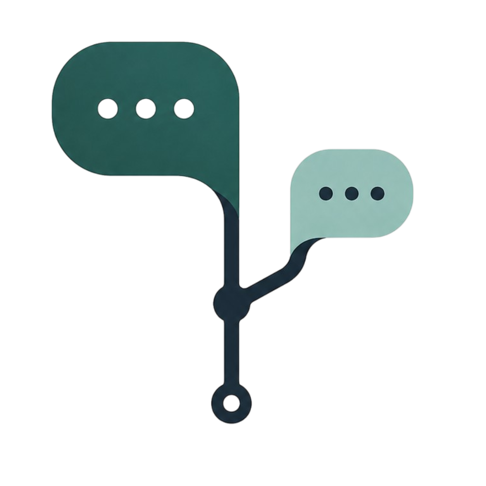

# Branch ⑂

**A chat client where the conversation is a tree, not a line.**

Ask an LLM about statistics and it mentions "p-value" in passing. You want to
know what that means — but asking derails the thread, and asking in a new chat
throws away the context that made the question worth asking. So you *branch*:
highlight the phrase, ask about it in a side thread, and the main conversation
stays exactly where you left it.

<p>
  
  
  
  
</p>

[](https://ko-fi.com/Z5I423V25G)


*(full-quality video: [brag.mp4](brag-output-2026-07-24-231924/brag.mp4))*

## What it does

- **Branch any phrase.** Highlight a word in a reply and ask about it in a side
  thread — the main conversation never moves.
- **Cheaper by design.** Branches send only the path from the root, and sibling
  branches share a byte-identical prefix, so [prompt caching](#why-it-costs-less)
  compounds the saving.
- **Three views of one tree.** A linear **Chat**, a pannable **Graph** canvas
  (each branch its own colour *and* dash pattern), and a **Notes** doc you clip
  findings into.
- **Ask several models at once.** Fan one question out to multiple models —
  Claude, GPT, or a local Ollama model — and each answer becomes its own branch
  to compare side by side.
- **Bring your own model.** Claude and OpenAI via API key, or run entirely free
  and offline on a local [Ollama](https://ollama.com) model. Pick per session,
  or per branch.
- **Attach files, search everything, keep it local.** Drag images/text onto the
  canvas and connect them to a question; full-text search (⌘K) across every
  message; all data stays on your machine.

> A 20-second look at it lives in [`brag-output/brag.mp4`](brag-output/brag.mp4).

## Table of contents

- [Quick start](#quick-start--how-to-run-it-right-now)
- [Prebuilt app (one-click install)](#prebuilt-app--one-click-install-macos--windows)
- [Running free on a local model](#running-it-entirely-on-a-local-model)
- [Why it costs less](#why-it-costs-less)
- [The three tabs](#the-three-tabs)
- [Files](#files) · [Web search](#web-search) · [Colour](#colour)
- [Tests](#tests) · [Layout of the code](#layout-of-the-code)
- [What&#39;s next](#whats-next) · [Contributing](#contributing) · [License](#license)

---

## Quick start — how to run it right now

Two commands, from the project root (`/Users/aseem/myai/claude-gui-aseem`).

```sh
# 1. Build the UI (only needed after frontend changes)
cd frontend && npm install && npm run build && cd ..

# 2. Launch the desktop app
uv run python backend/app.py
```

That's it. **You do not need to activate anything** — `uv run` creates and uses
`.venv/` for you and installs from `pyproject.toml` on first run.

<details>
<summary>If you'd rather activate the venv the traditional way</summary>

```sh
uv sync                      # creates .venv/ and installs dependencies
source .venv/bin/activate    # fish: source .venv/bin/activate.fish
python backend/app.py
deactivate                   # when done
```

Both routes run the same interpreter. `uv run` just skips the activation step.

</details>

**The file to run is `backend/app.py`.** It opens the pywebview window and
serves `frontend/dist/`. If `frontend/dist/` doesn't exist it falls back to the
Vite dev server on `localhost:5173` and opens with devtools — handy while
working on the UI:

```sh
cd frontend && npm run dev     # terminal 1
uv run python backend/app.py   # terminal 2 — picks up the dev server
```

### Running it free, on a local model

Nothing above needs an API key. With Ollama running you can use it end to end
for free — see [Running it entirely on a local model](#running-it-entirely-on-a-local-model)
below for model choices and what works with each.

```sh
ollama serve        # terminal 1, leave running
ollama pull gemma3:4b
```

Then pick the model under **ollama** in the composer's dropdown.

### Where your data lives

```
~/.branch/branch.db          conversations, branches, notes, attachment records
~/.branch/files/<tree-id>/   copies of attached files
~/.branch/keys.json          API keys, owner-only permissions
```

Deleting `~/.branch/` resets the app completely.

---

## Prebuilt app — one-click install (macOS / Windows)

Don't want to touch a terminal? Grab a build from the
[Releases page](https://github.com/iamgeekyaseem/mood-chat/releases) instead
of running it from source.

**macOS**
1. Download `Branch.dmg`.
2. Double-click it, then drag **Branch** into **Applications**.
3. Open **Branch** from Applications (or Spotlight).
4. First launch: macOS will say it's from an unidentified developer (the
   build isn't code-signed) — right-click the app → **Open** → **Open** to
   confirm once. After that it opens normally.

**Windows**
1. Download `Branch.exe`.
2. Double-click it. That's the whole app — nothing to install or unzip.
3. First launch: SmartScreen may warn it's unrecognized (unsigned build) —
   click **More info** → **Run anyway**.

Either way, your data still lives under `~/.branch` (`C:\Users\<you>\.branch`
on Windows) — same as running from source, see
[Where your data lives](#where-your-data-lives) above.

These builds come from [`.github/workflows/build.yml`](.github/workflows/build.yml),
which runs on every `v*` tag push (or manually via
**Actions → Build desktop app → Run workflow**) and builds natively on a
macOS and a Windows runner, since PyInstaller can't cross-compile. The app
icon (`packaging/icons/Branch.icns` / `.ico`) is generated from
[`frontend/public/logo.png`](frontend/public/logo.png).

---

Ask an LLM about statistics and it mentions "p value" in passing. You want to
know what that means — but asking derails the thread, and asking in a new chat
loses the context that made the question worth asking. So you branch: highlight
the phrase, ask about it in a side thread, and the main conversation stays
exactly where you left it.

## Why it costs less

A branch is sent the path from the root to its branch point — not the whole
tree. Sibling branches never see each other. That alone cuts tokens.

The second saving is less obvious. Because siblings share a byte-identical
ancestor prefix, prompt caching applies: the first branch off a node *writes*
the cache, and every later branch off that same node *reads* it at roughly 0.1×
input cost. The tree structure and the cache structure are the same structure.

Two constraints this design has to respect:

- The minimum cacheable prefix is 4,096 tokens on Opus 4.8 (2,048 on Sonnet 5).
  Below that the API silently declines to cache — no error, just no saving. The
  composer shows whether the current prefix clears the bar.
- Caches are scoped to a single model. Switching provider on a branch forfeits
  the cache its siblings share.

## Context modes

Chosen per branch, from the composer:

| Mode        | What gets sent                                         |
| ----------- | ------------------------------------------------------ |
| `minimal` | The highlighted phrase and the message it came from    |
| `path`    | Every ancestor from root to the branch point (default) |
| `full`    | The entire tree, siblings included                     |

## Conversations

The left sidebar is your history. Each entry is a whole workspace — its own
branches, notes, and attachments — so switching swaps everything, not just the
visible thread. Conversations are titled automatically from their first message,
and can be renamed (✎) or deleted (✕, with a confirm, since it takes the notes
and files with it). The app reopens your most recent conversation on launch.

`+ New session` in the top bar is a different thing: an independent root
*inside* the current conversation, which shows as a separate tree on the canvas.
Use conversations to separate topics, sessions to explore in parallel on one
board.

## The three tabs

**Chat** — reads like a normal conversation. Model replies render as markdown
with syntax-highlighted code; your own messages stay verbatim.

```
┌──────────┬───────────────────────────────┬──────────────┐
│  MINIMAP │  MAIN THREAD                  │  BRANCHES    │
│          │                               │              │
│  whole   │  reads like a normal chat     │  side threads│
│  tree +  │  select any phrase to branch  │  as cards;   │
│  you-are-│  or clip it to notes          │  click one   │
│  here    │                               │  to open it  │
└──────────┴───────────────────────────────┴──────────────┘
```

Opening a branch promotes it to the centre column; the thread you were reading
becomes reachable via "← main thread" in the rail.

**Graph** — the same tree as a pannable flowchart. Sibling branches fan out into
their own columns, cards are draggable (positions persist), and each card can be
starred or clipped. "New session" starts an independent conversation on the same
canvas — the tree model has always allowed several roots, so a playground of
parallel explorations is the same data structure.

The Graph has its own composer, so you can work entirely on the canvas: click a
card to target it, type, send, and the reply appears in place. `↗ chat` opens a
card's thread in the Chat tab when you want to read it linearly.

**Notes** — the findings document. Clippings land here as markdown blockquotes
carrying their source branch; edit in place, preview, export to `.md`.

Two ways in, with different rules:

| Action                                           | Limit          | Marker                                                   |
| ------------------------------------------------ | -------------- | -------------------------------------------------------- |
| `+ notes` on a message — adds the whole thing | **once** | control becomes`in notes ✓`, message gets a gold rule |
| select text →`+ Notes` — adds an excerpt     | unlimited      | `✎ n` count on the message                            |

The whole-message cap exists because a second add would append identical text.
Excerpts stay unlimited because pulling three different sentences out of one
reply is a normal thing to want. The cap is enforced in the backend as well as
the UI — re-enabling the disabled button and clicking gets refused.

Theme follows the OS by default; the ☾/☀ control in the nav overrides it and
persists.

## Files

`+ file` (composer or Graph toolbar) copies a file into the app's store and
drops it on the canvas as its own node. Drag from its handle to any message to
link them — from then on that file rides along in the context for anything
asked at or below that point. Delete an edge to unlink; the file stays.

Files are **copied, not referenced**, so a conversation still resolves after the
original is moved or deleted.

| Type                                   | Card preview         | What the model gets                                   |
| -------------------------------------- | -------------------- | ----------------------------------------------------- |
| png / jpeg / gif / webp                | downscaled thumbnail | the image, if the model has vision                    |
| text, markdown, csv, json, source code | first few lines      | contents inlined, truncated at 20k chars              |
| pdf                                    | none — says so      | a note naming the file and saying it couldn't be read |
| anything else                          | none — says so      | same                                                  |

PDFs get no thumbnail because rendering a page needs poppler or an equivalent
native dependency; showing a placeholder that implied otherwise would be worse
than the file type stated plainly. Thumbnails need Pillow — without it images
degrade to no preview rather than failing.

That last row is deliberate: silently dropping a file you explicitly attached
would be worse than saying it couldn't be read. Same when you attach an image to
a model without vision — you get told, not ignored.

Attachments ride the *new* turn, after the cache breakpoint, so attaching a file
to one branch never invalidates the prefix its siblings share.

## Web search

The `web` toggle in the composer. Two paths, picked automatically from what the
model can do:

| Model can      | Path             | Behaviour                                            |
| -------------- | ---------------- | ---------------------------------------------------- |
| call tools     | **tool**   | the model decides when to search                     |
| not call tools | **inject** | we search first and hand the results over as context |

The inject path exists because most small local models can't call tools — and
are poor judges of when a search is warranted even when they can. Claude uses
its own server-side search instead of either path.

Results are wrapped in an envelope naming them as untrusted reference material,
so a page saying "ignore your instructions" reads as quoted content rather than
as a request.

## Colour

Two channels, kept strictly separate:

- **Hue = identity.** Which branch a message belongs to.
- **Neutral ink + stroke weight = state.** Active path, selection, focus.

The branch palette is four hues, validated all-pairs in both light and dark
against this app's surfaces with the `dataviz` skill's validator. Two results
constrain how it may be used:

| Mode  | Finding                                  | Consequence                                                     |
| ----- | ---------------------------------------- | --------------------------------------------------------------- |
| light | yellow 2.08:1, magenta 2.58:1 vs surface | below 3:1 — "relief" required                                  |
| dark  | green↔yellow CVD ΔE 6.9                | inside the 6–8 warn band — legal only with secondary encoding |

Both are discharged by one rule, enforced in the components: **a branch is never
rendered as colour alone — its anchor text always shows.**

There is deliberately no fifth hue. Past four branches the slot falls back to
neutral and the label does all the work; generating a fifth colour would break
the validated set. Slots are assigned once at branch creation and persisted, so
pruning branch #1 never repaints #2 and #3.

An earlier teal accent was removed for measuring ΔE 14.2 from the green slot —
below the 15 floor, meaning an active-path edge and a green branch were not
reliably distinguishable. That is why structure is neutral.

Message roles carry their own low-chroma tints — you (cool), assistant (warm) —
chosen not to compete with the saturated branch hues.

## Running it

```sh
# Backend deps
uv sync

# Frontend (dev — hot reload, mock model responses in a browser)
cd frontend && npm install && npm run dev

# Desktop app (builds the frontend, then opens the pywebview window)
cd frontend && npm run build && cd ..
uv run python backend/app.py
```

Without `frontend/dist`, the app points at the Vite dev server on :5173 and
opens with devtools enabled.

## Running it entirely on a local model

No API key, no network cost. This is the fastest way to exercise the whole app.

### 1. Install and start Ollama

```sh
brew install ollama          # or: https://ollama.com/download
ollama serve                 # leave running in its own terminal
```

Verify it's up — this should return JSON, not a connection error:

```sh
curl -s http://localhost:11434/api/tags
```

### 2. Pull a model

Which model you pull decides which features work, so pick against the table:

| Model                   | Size    | Vision | Tools | Good for                                       |
| ----------------------- | ------- | ------ | ----- | ---------------------------------------------- |
| `gemma3:4b`           | 3.3 GB  | ✅     | ❌    | images + branching; search via the inject path |
| `qwen3:8b`            | ~5 GB   | ❌     | ✅    | model-driven web search                        |
| `llama3.2-vision:11b` | ~7.8 GB | ✅     | ❌    | better image reading                           |
| `qwen2.5:7b`          | ~4.7 GB | ❌     | ✅    | tool calling on modest hardware                |

```sh
ollama pull gemma3:4b
```

There is no single local model here that does both vision *and* tool calling.
If you want to exercise both paths, pull one of each and switch models per
branch — which is exactly what per-branch provider choice is for.

### 3. Install dependencies and run

```sh
uv sync
cd frontend && npm install && npm run build && cd ..
uv run python backend/app.py
```

### 4. Point the app at it

In the composer's model dropdown, pick the model under the **ollama** group.
Ollama's list is discovered at launch from what you have pulled — if you pull a
model while the app is open, restart it to pick the model up.

### What to expect

- **Branching, notes, stars, graph, dark mode** — all work identically; none of
  them touch a model.
- **Context modes and token counts** — work, but the count is a ~4-chars-per-token
  estimate. Ollama has no token-counting endpoint, so it can't be exact.
- **Prompt caching** — shown as unavailable, correctly. Ollama exposes no cache
  breakpoints, so the "cached" indicator stays off. The sibling-prefix saving is
  a Claude-only benefit; the *structural* saving (branches don't see each other)
  still applies everywhere.
- **Images** — work on a vision model. Attach on the Graph tab, connect to a
  message, ask about it. On a non-vision model you get an explicit note rather
  than silence.
- **Web search** — works on any model. With `gemma3:4b` it takes the inject
  path; you'll see a "searching the web…" status in the composer before the
  answer streams.

### Verifying without the GUI

To check the backend against Ollama directly:

```sh
uv run python -c "
import asyncio, sys; sys.path.insert(0, 'backend')
from providers.ollama_provider import OllamaProvider

async def main():
    p = OllamaProvider()
    await p.refresh_models()
    for m in p.models():
        print(f'{m}: vision={p.supports_vision(m)} tools={p.supports_tools(m)}')
    async for c in p.stream(p.models()[0],
            [{'role':'user','content':'In one sentence, what is a p-value?'}],
            search_mode='on'):
        if c.status: print('[', c.status, ']')
        if c.text: print(c.text, end='')
asyncio.run(main())
"
```

### Troubleshooting

| Symptom                                | Cause                                                                                                                |
| -------------------------------------- | -------------------------------------------------------------------------------------------------------------------- |
| ollama group missing from the dropdown | `ollama serve` isn't running — the app greys it out rather than erroring                                          |
| `does not support tools`             | expected on gemma3; search silently uses the inject path instead                                                     |
| image attached but ignored             | the model has no`vision` capability — the reply will say so                                                       |
| web search returns nothing             | no network, or`ddgs` is blocked; the model is told the search was empty rather than being left to invent an answer |

### API keys

Stored at `~/.branch/keys.json`, mode 0600. Anthropic also picks up
`ANTHROPIC_API_KEY` or an `ant auth login` profile, so an unset env var does not
necessarily mean no credentials. Ollama needs no key — it just needs to be
running.

## Tests

```sh
uv run --with pytest --with pytest-asyncio pytest tests/ -q
```

The one worth knowing about is
`test_siblings_share_a_byte_identical_prefix`. It asserts the invariant the
whole token-saving story rests on: if a change makes sibling prefixes differ by
a single byte, caching silently stops working and nothing in the UI would tell
you. That test fails instead.

## Layout of the code

```
backend/
  tree.py       nodes, parentage, traversal, pruning, colour-slot allocation
  context.py    the three context modes + cache breakpoint placement
  store.py      SQLite; the tree is rebuilt from parent_id. Migrations are
                applied on open, so an older branch.db keeps working
  app.py        pywebview shell and the JS bridge
  providers/    anthropic (caching), openai, ollama
frontend/src/
  bridge.ts     pywebview calls + a mock so the UI runs in a plain browser
  colors.ts     the validated branch palette and its usage constraints
  tree.ts       client mirror of traversal, plus minimap layout
  useTheme.ts   light/dark resolution (the two palettes are separate sets)
  components/   Minimap, Message, Composer, BranchRail, GraphView, NotesView
packaging/icons/  Branch.icns / Branch.ico, generated from logo.png
.github/workflows/build.yml   builds the macOS .dmg and Windows .exe
```

## Other controls

| Control         | Where                    | What it does                                                                                                                                     |
| --------------- | ------------------------ | ------------------------------------------------------------------------------------------------------------------------------------------------ |
| ⌕ / ⌘K        | top bar                  | Full-text search over every message; scope to this chat or all. Arrow + Enter to jump.                                                           |
| ⚙              | top bar                  | API keys. Write-only — saved keys are never read back into the form.                                                                            |
| ☾ / ☀         | top bar                  | Theme override; follows the OS until you set it.                                                                                                 |
| ■ Stop         | top bar, while streaming | Cancels the response. Whatever arrived is kept.                                                                                                  |
| ★ Starred only | Graph toolbar            | Filters to starred nodes**and their ancestors** — a starred node with its lineage cut away loses the context that made it worth starring. |
| ⤢ Reset layout | Graph toolbar            | Snaps every dragged card back to the automatic layout. Nothing is lost.                                                                          |

**On the graph, a branch is one continuous strand with its own colour _and_ dash
pattern** — a solid-ish dash, fine dots, or a dash-dot, keyed to the same slot
as the colour. Two branches running near each other are distinguishable by line
style, not colour alone (and it survives colour-blindness). The main thread
stays a solid neutral grey. Auto-layout keeps cards from overlapping, and
**Reset layout** snaps everything back if you've dragged things around.

## What's next

See [ROADMAP.md](ROADMAP.md) for planned features and the known rough edges.

## Architecture

```
Python backend  ──JS bridge──▶  React frontend  ──pywebview──▶  native window
  (providers,       (streamed        (Chat / Graph / Notes,
   SQLite, tree)     via events)      React Flow canvas)
```

- **Backend** (`backend/`) — the conversation tree, SQLite persistence with
  FTS5 search, attachment handling, and a provider abstraction over Claude
  (with prompt caching), OpenAI, and local Ollama.
- **Frontend** (`frontend/`) — React + TypeScript + Tailwind, React Flow for
  the graph canvas. Talks to Python over pywebview's JS bridge; a mock keeps it
  developable in a plain browser.
- **Security** — the JS↔Python boundary validates every id, the bridge uses an
  injection-proof base64 channel, and there's a CSP. See [SECURITY.md](SECURITY.md).

## Contributing

Issues and pull requests are welcome.

1. Fork and branch off `main`.
2. Backend changes: keep the test suite green — `uv run pytest tests/ -q`.
3. Frontend changes: `cd frontend && npm run build` must pass (it type-checks).
4. Keep the comment style and altitude of the surrounding code; explain the
   *why*, not the *what*.

There's no CLA and no bureaucracy — it's a personal project shared in the open.

## License

[MIT](LICENSE) © 2026 Aseem Gupta. Do whatever you like with it; no warranty.

## Acknowledgements

- [pywebview](https://pywebview.flowlade.com/) for the native shell.
- [React Flow](https://reactflow.dev/) for the graph canvas.
- [Ollama](https://ollama.com/) for free local models.
- The branch-colour palette is validated for colour-blind safety with the
  `dataviz` skill's checker; the launch video was built with Hyperframes.
